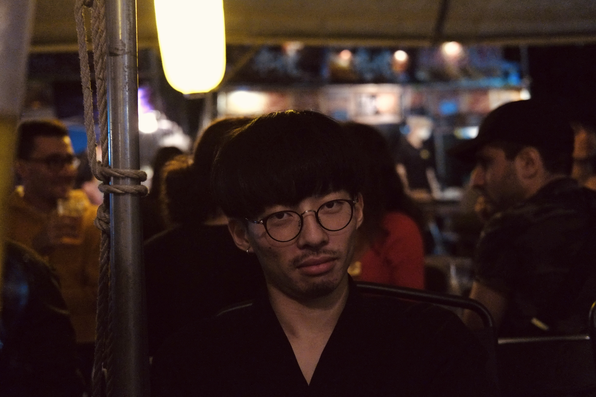
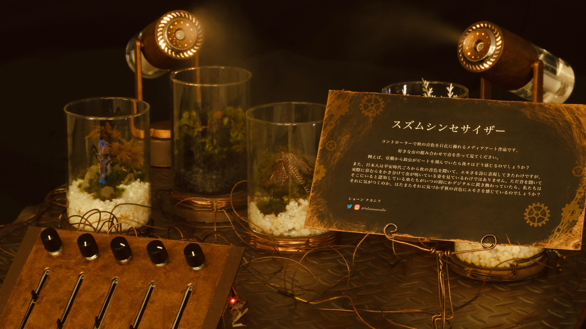
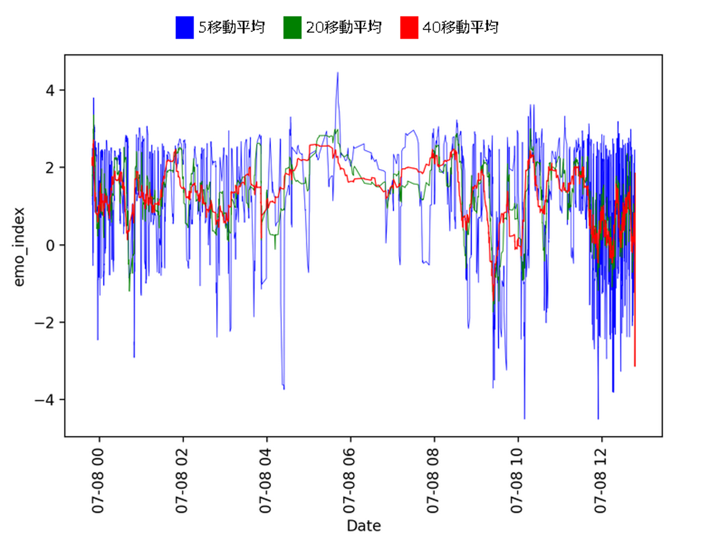
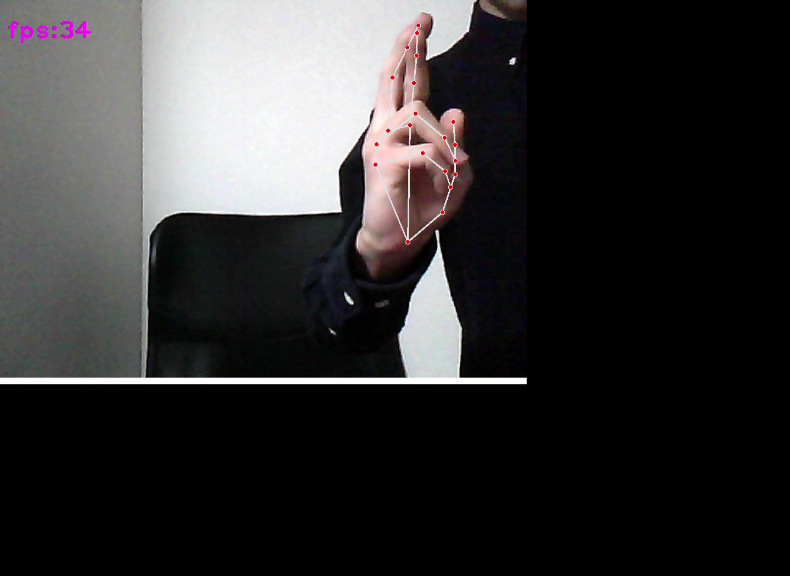
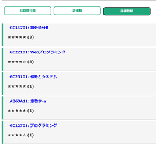
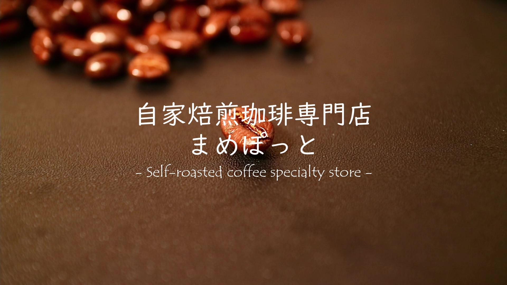

これは第3者も追記できるWiki的なポートフォリオです。
This is a wiki-style portfolio to which a third party can also add.

----------------------
# Shon Nakamura　中村翔音

# Profile
2001年長野県飯山市出身。  
筑波大学 情報メディア創成学類所属。  

# History

|Year|Content|
|:--|:--|
|2001|長野県飯山市出身|
|2011|魚とりにハマる　そして絶滅危惧種を発見する|
|2013|スキージャンプを始める|
|2015|ケガをしてやめる|
|2017|長野県飯山高校入学|
|2018|豪雪地域の屋根の形状について課題研究をする   スピーチコンテストCMA(Change Maker Awards)で銅賞を取り留学支援金を受け取れることになったものの，コロナでパーになる|
|2019|長野県飯山高校卒|
|2020|筑波大学情報メディア創成学類入学   釣りにハマる   コーヒーにハマる|
|2021|一瞬だけNu ink.に入る   東京オリンピックのITエンジニアという聞こえだけ強そうなバイトをする|
|2022|テラリウム製作にハマる   キャンパスOJTに足を踏み入れてしまう   Digital Nature Groupに所属|

# Production
## 2022
- ### [スズムシンセサイザー](https://www.instagram.com/reel/CkwgpgDD7EY/?utm_source=ig_web_copy_link)
  任意の秋の音色を作ることができる音が鳴るテラリウム
   
  

- ### [FaceGraph](https://github.com/MiyamotoRin/FaceGraph-Flask)
  変顔で多次元のデータの特徴を表すデータ可視化Webアプリケーション。人間の感性を利用した可視化手法。
- ### Twitter感情分析
  筑波大という感情の大きな波が存在してそれを捉えられるのでは？と思って作ってみた
   
  
- ### 無量空処
  指を重ねるとジェスチャーを認識し，PCをフリーズさせる呪術を修得した
   
  
  

## 2021
- ### 授業レビューサイト
  授業アンケートを答えても改善されない授業の透明性のあげる策として作った。この世から地雷授業は無くなればいい。取りたい授業を安心して取りに行けるのが本当の学際性だと思う。
   
  

- ### まめぽっとのプロモーション動画制作
  近所のコーヒー豆屋さんのプロモーション動画を授業の一環で制作した。
   
  

## 2020
- ### [課題研究をする高校生のための先行研究を集めたポータルサイト](https://shaunnnaka.github.io/tipschest/)

# Random
- なんか

# Cf

- [Udemy学生モニターをしたときに記事にしてもらったやつ①](https://udemy.benesse.co.jp/career/user_story/ufu2022-nakamura.html)
- [Udemy学生モニターをしたときに記事にしてもらったやつ②](https://udemy.benesse.co.jp/career/user_story/ufu2022-nakamura.html)